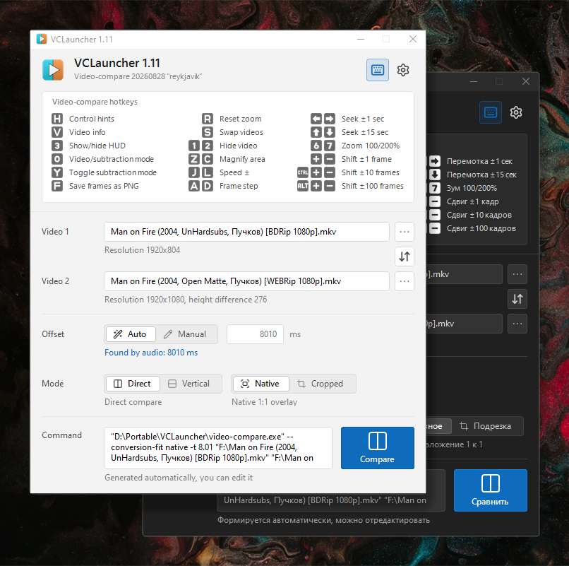

[Русский](README.md) | [English](README.EN.md)

#  VCLauncher

 

A handy GUI launcher for [Video-compare](https://github.com/pixop/video-compare). It helps you visually compare two versions of a movie and pick the best one for your collection. It finds the time offset between releases on its own.

   
  Native overlay: Blu-ray release on the left, Open Matte 16:9 hybrid on the right

### Features

- Two overlay modes: native or cropped to a common height
- Quick detection of the time offset between files
- The comparison window shrinks if the video doesn't fit the screen
- Quick switching between comparison modes: direct or vertical
- Drag-and-drop support
- The `Video-compare` launch command can be edited
- Cheat sheet with the main `Video-compare` hotkeys
- Cached resolutions and offsets, files and settings are remembered
- Light and dark themes, English and Russian
- The `Video-compare` console is hidden, errors are shown in a dialog

### VCLauncher uses (bundled in the release)

- [`Video-compare`](https://github.com/pixop/video-compare) – comparison: overlay, modes, hotkeys
- [`FFmpeg`](https://github.com/FFmpeg/FFmpeg) – video resolution and frames for offset detection
- [`Sync`](SYNC.EN.md) – time offset detection between files

### Note

⚠️ Your antivirus may falsely flag the exe files. This is a known quirk of compiled AutoIt scripts and PyInstaller builds. The launcher source code is open, you can review it and compile it yourself.
