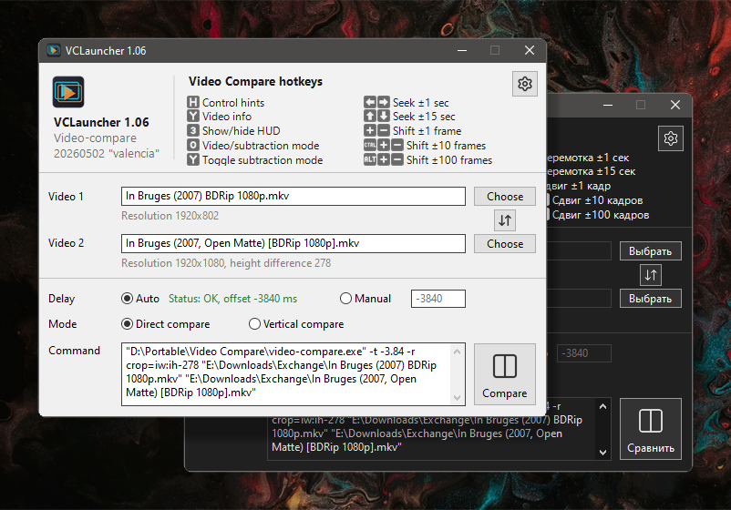
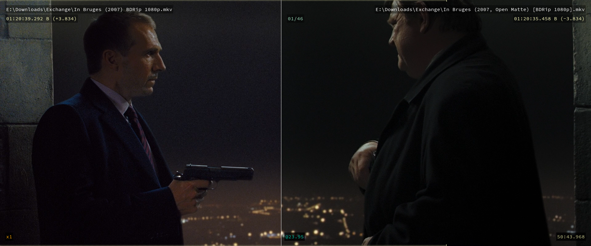

[Русский](README.md) | [English](README.en.md)

# &nbsp; VCLauncher

 

A handy GUI launcher for [Video Compare](https://github.com/pixop/video-compare). It helps you visually compare two versions of a movie and decide which one fits your collection better. You can also quickly detect a time offset and use it to transfer audio tracks between releases.

### Features

- ✂️ Automatic height-crop calculation for comparing videos with different aspect ratios
- ↔️ Quick detection of the time offset between video files
- Auto-scaling the window when the video exceeds the screen
- Quick switching between comparison modes
- Drag-and-drop support
- Manual editing of the `video-compare` launch command
- Cheat sheet with some commonly used `video-compare` hotkeys
- Caching and autosave
- Theme and localization support
- Hiding the `video-compare` console

### VCLauncher uses (already bundled in the release)

- `Video-compare` - the comparison engine itself
- `FFmpeg.exe` - [FFmpeg](https://github.com/FFmpeg/FFmpeg) for extracting audio/video streams
- `Sync.exe` - a custom time-offset detection utility
