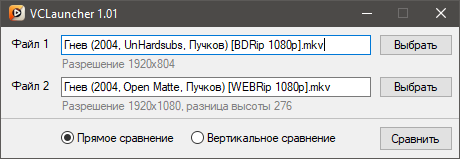

# &nbsp; VCLauncher

Удобный GUI лончер для [Video-compare](https://github.com/pixop/video-compare)

### Возможности

- ✂️ Автоматический расчет подрезки высоты, для сравнения видео с разными пропорциями
- 🖥️ Автоматическое масштабирование, если видео выходит за пределы экрана
- ↔️ Быстрое переключение между режимами сравнения
- 🎯 Поддержка Drag-and-drop
- 💾 Автосохранение последних выбранных файлов

### VCLauncher использует, уже включено в релиз

- [FFmpeg](https://github.com/FFmpeg/FFmpeg) - ffprobe.exe
- [Video-compare](https://github.com/pixop/video-compare)
