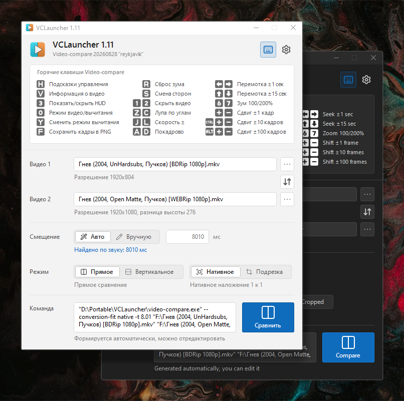
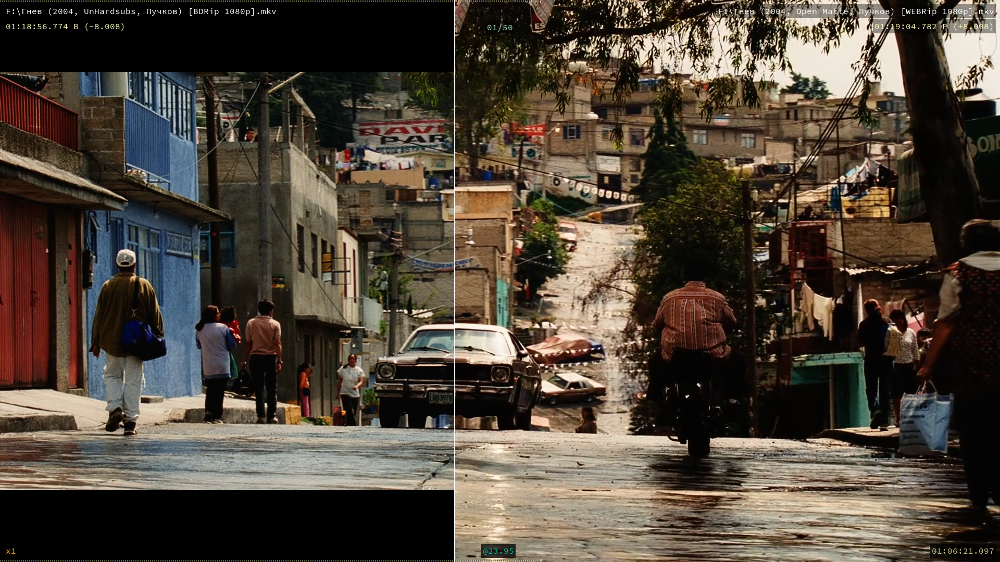

[Русский](README.md) | [English](README.en.md)

# &nbsp; VCLauncher

 

Удобный GUI-лаунчер для [Video-compare](https://github.com/pixop/video-compare). Помогает наглядно сравнить две версии фильма и решить, какая лучше подойдёт для коллекции. Также можно быстро определить рассинхрон и использовать его для переноса аудиодорожек между релизами.

### Возможности

- ✂️ Автоматический расчет подрезки высоты для сравнения видео с разными пропорциями
- ↔️ Быстрый поиск временной задержки между видеофайлами
- Автомасштабирование окна, если видео выходит за пределы экрана
- Быстрое переключение между режимами сравнения
- Поддержка перетаскивания drag-and-drop
- Возможность ручного редактирования команды запуска `video-compare`
- Шпаргалка с некоторыми часто используемыми хоткеями `video-compare`
- Кеширование и автосохранение
- Поддержка темы и локализации
- Скрытие консоли `video-compare`

### VCLauncher использует (уже включено в релиз)

- [Video-compare](https://github.com/pixop/video-compare) - сам движок сравнения
- [FFmpeg](https://github.com/FFmpeg/FFmpeg) - для извлечения аудио/видео потоков
- `Sync.exe` - собственная CLI утилита для поиска временного сдвига

## 🤝 Поддержка
Баг‑репорты и предложения приветствуются.
Поддержка: [CloudTips](https://pay.cloudtips.ru/p/c4a97b44)
