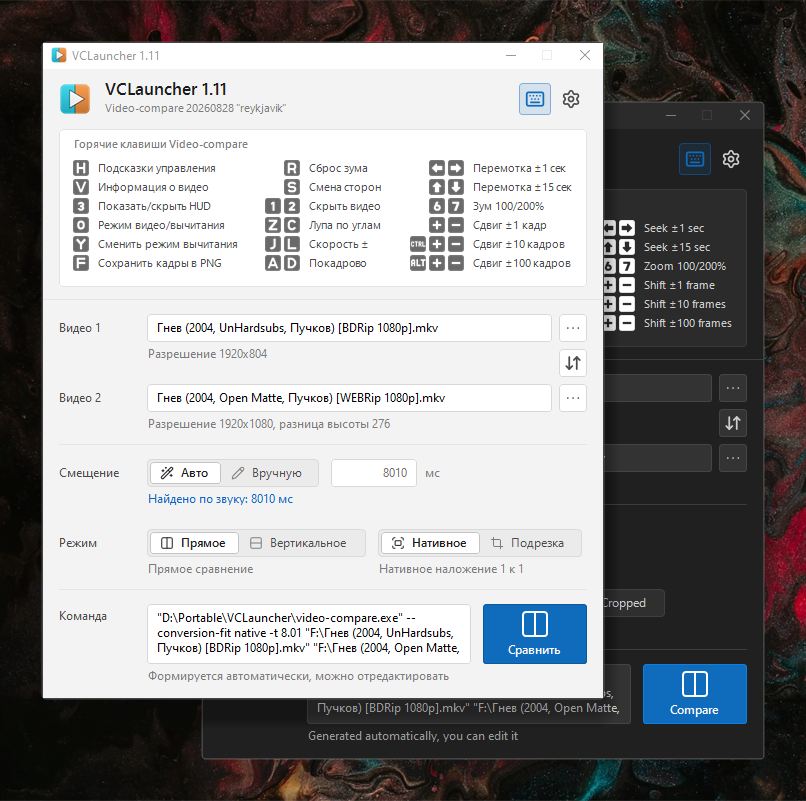
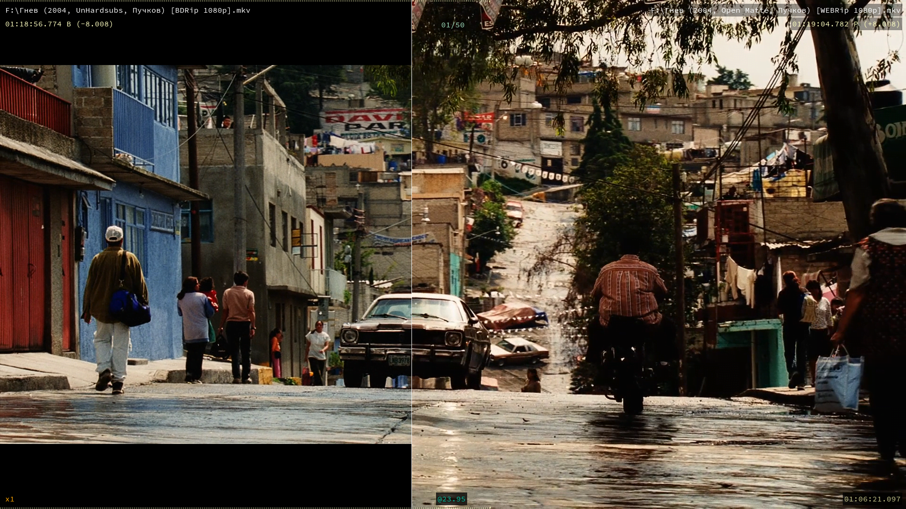

[Русский](README.md) | [English](README.EN.md)

#  VCLauncher

 

Удобный GUI-лаунчер для [Video-compare](https://github.com/pixop/video-compare). Помогает наглядно сравнить две версии фильма и выбрать лучшую для коллекции. Сам находит смещение между релизами.

*Нативное наложение: слева Blu-ray релиз, справа Open Matte 16:9 гибрид*

### Возможности

- Два способа наложения: нативное или с подрезкой до общей высоты
- Быстрый поиск временной задержки между файлами
- Окно сравнения уменьшится, если видео выходит за пределы экрана
- Быстрое переключение между режимами сравнения: прямое или вертикальное
- Поддержка перетаскивания drag-and-drop
- Команду запуска `Video-compare` можно отредактировать
- Шпаргалка по основным горячим клавишам `Video-compare`
- Кеш разрешений и смещений, файлы и настройки запоминаются
- Светлая и тёмная тема, русский и английский язык
- Консоль `Video-compare` скрыта, ошибки показываются в окне

### VCLauncher использует (уже включено в релиз)

- [Video-compare](https://github.com/pixop/video-compare) - сам движок сравнения
- [FFmpeg](https://github.com/FFmpeg/FFmpeg) - для извлечения аудио и видео потоков
- `Sync` - консольная утилита для поиска смещения, [описание алгоритма](SYNC.md)

### Примечание

⚠️ Антивирус может ложно срабатывать на exe-файлы. Это известная особенность скомпилированных AutoIt скриптов и PyInstaller сборок. Исходный код лаунчера открыт, можно изучить его и скомпилировать самостоятельно.
